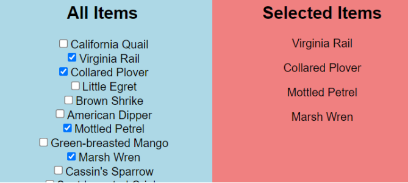

In this exercise I created a mock api to createa list of items
then I fetch them in my app and displayed them in all items section
each checked item in all item section will be listed in selected items
I used context to keep track of selected items

